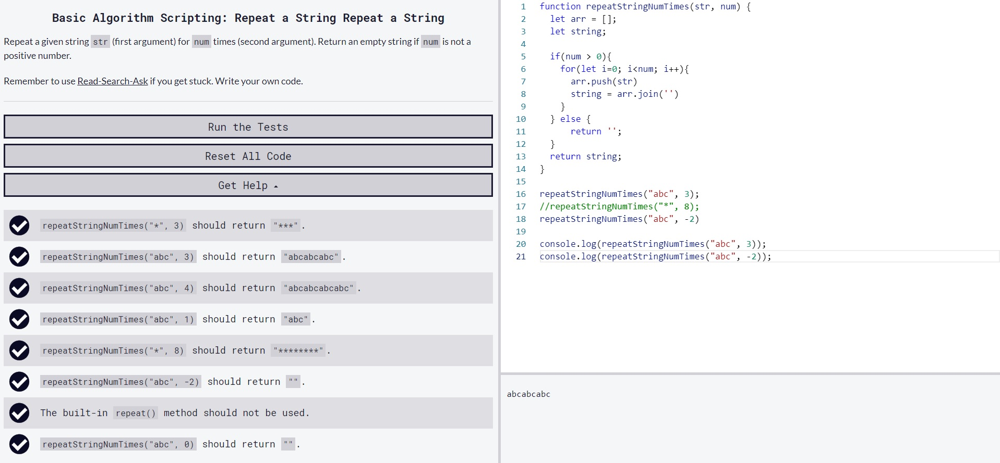
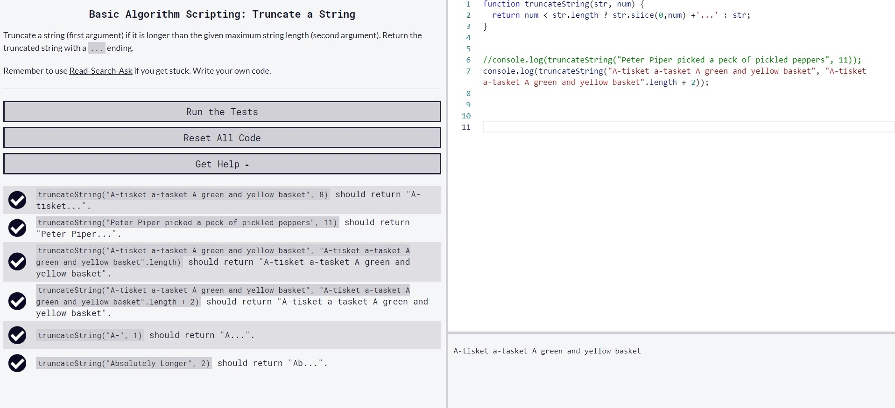

# In this folder you can find some of my exercises from https://www.freecodecamp.org/badvilgo

## Table of contents

* [General info](#general-info)
* [Screenshots](#screenshots)
* [Technologies](#technologies)

## General info
I use many sources to learn such as youtube, udemy, treehouse, developer.mozilla, w3schools and so on but freecodecamp is my favourite source of exercises for now, except my own projects.

## Screenshots
* Basic_Algorithm_Scripting_Find_the_Longest_Word_in_a_String 

* Basic_Algorithm_ScriptingReturn_Largest_Numbers_in_Arrays

* Basic Algorithm Scripting Confirm the Ending

* Basic_Algorithm_Scripting_Repeat_a_String_Repeat_a_String

* Basic_Algorithm_Scripting_Truncate_a_String

## Technologies
* JavaScript 

